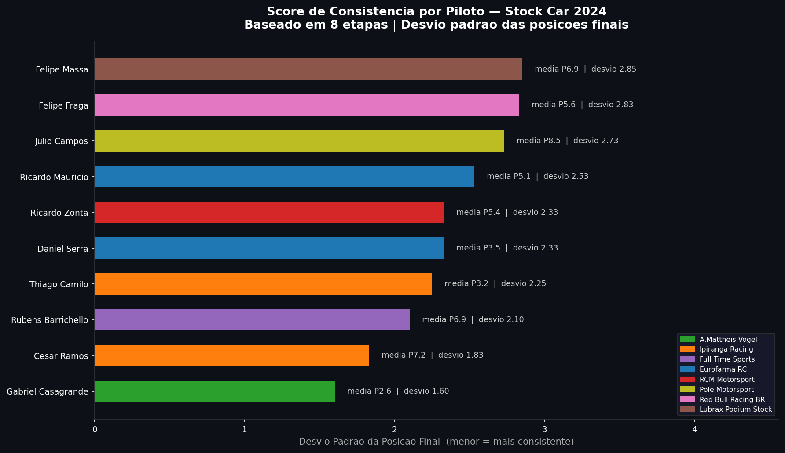
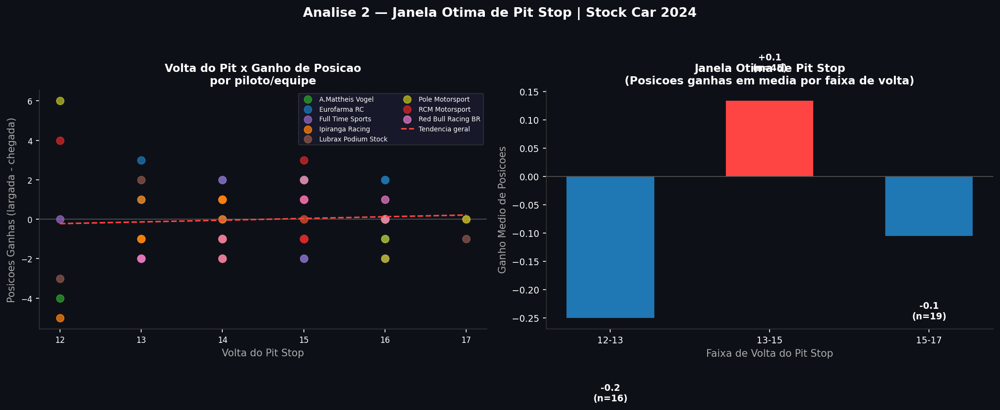
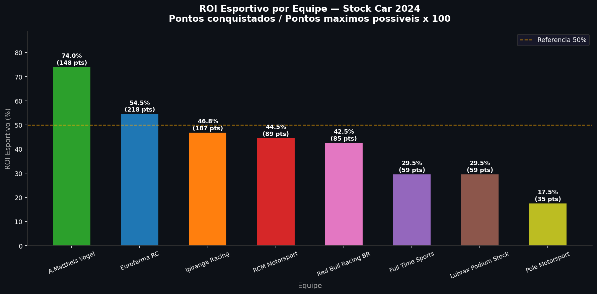
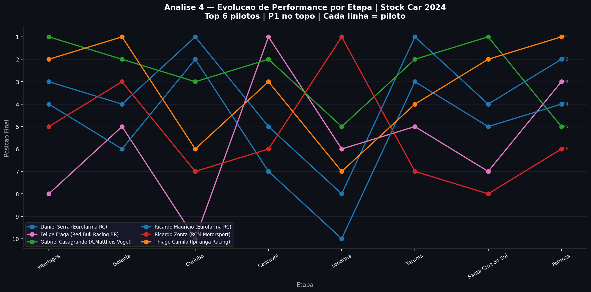

<div align="center">

# 🏎️ Stock Car KPIs Analytics

**Data Engineering pipeline applied to Brazilian motorsport**

[](https://github.com/Cavalchi/StockCarKPIs/actions/workflows/ci.yml)


*Transforming raw Stock Car Brasil data into real competitive intelligence*

[🇧🇷 Leia em Português](README.md)

</div>

---

## The Problem

The official Stock Car website publishes race-by-race result tables — final positions, pit stops, starting grids. Just raw data. To give scale to this project, we used **data from 3 seasons of Stock Car Brasil (2022–2024), 18 rounds per season, 34 drivers**.

**What no team analyst can easily see in this data:**
- Which driver is *statistically* more consistent throughout the season?
- On which laps did teams that **gained positions** pit — and what is the ideal window?
- Which team is making the *best* use of their equipment, regardless of wins?
- Who is evolving in the championship and who is stagnating?

This project automates collection, structures data in a relational database, and answers these questions with SQL and interactive visualizations.

---

## Architecture

```
┌───────────────────┐      ┌──────────────────────┐      ┌─────────────────────┐
│   data/raw/*.csv  │─────▶│  scraper/load_db.py  │─────▶│  PostgreSQL (Docker)│
│    (3 seasons)    │      │  Validation + ETL    │      │  3 related tables   │
└───────────────────┘      └──────────────────────┘      └──────────┬──────────┘
                                                                    │
                                                        ┌───────────▼──────────┐
                                                        │  dashboard/app.py    │
                                                        │  streamlit_app.py    │
                                                        │  5 analytics + charts│
                                                        └──────────────────────┘
```

**Database Schema:**
```
corridas  (id, data, circuito, condicoes_pista, temporada)
    │
    ├──▶  resultados  (corrida_id, piloto, equipe, posicao, posicao_largada, voltas)
    │
    └──▶  pit_stops   (corrida_id, piloto, equipe, volta, duracao_s)
```

---

## Stack

| Tool | Role in project |
|---|---|
| **Python 3.10** | ETL pipeline orchestration and visualizations |
| **PostgreSQL 15** | Relational storage with constraints and foreign keys |
| **Docker Compose** | Isolated and reproducible database — runs anywhere |
| **SQLAlchemy** | Python → PostgreSQL connection, DataFrame insertion |
| **Pandas** | Data transformation and preparation for analysis |
| **Scikit-Learn** | Machine Learning predictive modeling (Random Forest) |
| **Matplotlib / Seaborn** | Static visualizations with dark theme and team palettes |
| **Streamlit / Plotly** | Interactive web dashboard |
| **Pytest / Flake8** | Testing and code linting |
| **GitHub Actions** | Automated CI/CD pipeline |

---

## The 5 Analytics

### 1 — Driver Consistency Score

> *"Who consistently delivers results every race, regardless of the circuit?"*

Measures the **standard deviation of final positions** throughout the season.
A consistent driver has a low STDDEV — always finishing in the same region, regardless of circuit or track conditions. This is crucial for championship strategy.



---

### 2 — Optimal Pit Stop Window

> *"On which laps did drivers who gained positions make their pit stops?"*

Correlates the pit stop lap with the number of positions gained or lost relative to the starting position. It helps identify undercut/overcut windows that actually yield positive net results.



---

### 3 — Team Sports ROI

> *"Which team extracts the maximum potential from every race?"*

Calculates `(Points Earned / Maximum Possible Points) * 100`.
A team that constantly finishes P4 and P5 with both cars may have a higher collective ROI than a team with one winner and one backmarker.



---

### 4 — Performance Evolution per Round

> *"Who improved in the second half of the season? Who suffered from regulation changes?"*

Time series of each driver's final position round by round.
Reveals car development trends, recoveries after mechanical issues, and the impact of adverse conditions.



---

### 5 — Final Position Prediction (Machine Learning)

> *"Given that I started P5 for Ipiranga Racing, where should I finish?"*

The dashboard features a **Random Forest Regressor** model trained on historical Stock Car data. It performs *feature engineering* on the team (One-Hot Encoding) and starting position to mathematically predict the final position, also reporting the Mean Absolute Error (MAE).


---

## How to Run

### Prerequisites
- Python 3.10+
- [Docker Desktop](https://www.docker.com/products/docker-desktop/) installed and running

```bash
# 1. Clone
git clone https://github.com/Cavalchi/StockCarKPIs.git
cd StockCarKPIs

# 2. Setup environment variables
cp .env.example .env          # edit if necessary (credentials, port, etc.)

# 3. Run everything using Makefile (Installs deps, spins up DB, runs ETL & opens Dashboard)
make all

# --- Or run individual commands ---
# make setup       (installs requirements and starts docker)
# make etl         (runs data pipeline)
# make dashboard   (opens streamlit)
# make test        (runs automated tests)
```

---

## Structure

```
StockCarKPIs/
├── data/
│   └── raw/                 # CSVs by season (data source 2022-2024)
├── stockcar_kpis/           # Main package
│   ├── __init__.py
│   ├── config.py            # Centralized config (DB, colors, constants)
│   ├── etl/
│   │   ├── scraper.py       # Selenium: official site data collection
│   │   └── load_db.py       # ETL: CSV → Validation → PostgreSQL
│   ├── analysis/
│   │   └── kpis.sql         # SQL for the 4 core analyses + bonus
│   └── dashboard/
│       ├── app.py           # Static charts (Matplotlib + Seaborn)
│       └── streamlit_app.py # Interactive Dashboard (Streamlit + Plotly)
├── tests/
│   └── test_etl.py          # Validation unit tests (pytest)
├── db/
│   └── schema.sql           # Database schema (single source of truth)
├── .env.example             # Environment variables template
├── Makefile                 # Command automation (setup, etl, test, etc.)
├── docker-compose.yml       # PostgreSQL 15 in container
└── requirements.txt         # Project dependencies
```

---

<div align="center">

*Data Engineering applied to Brazilian motorsport*
*Data collected from public sources — stockcar.com.br / Wikipedia*

</div>
